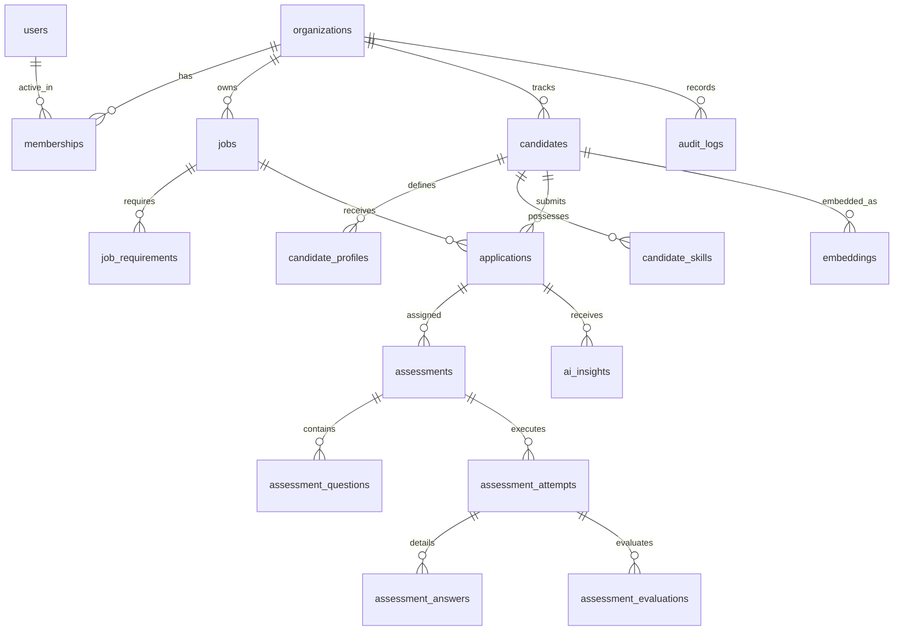

# AptiHire AI Architecture & System Design

This document specifies the technical architecture, data model, AI reliability model, and information architecture for AptiHire AI.

---

## 1. High-Level Architecture (Modular Monolith)

AptiHire AI is architected as a **Modular Monolith** built on top of Next.js. This guarantees low operational complexity, high local testing fidelity, and clean compile-time boundary enforcement between logical domains.

```text
                  ┌──────────────────────────────┐
                  │      Next.js Web Client      │
                  │   (App Router Pages & UIs)   │
                  └──────────────┬───────────────┘
                                 │ HTTP / JSON
                                 ↓
                  ┌──────────────────────────────┐
                  │    Next.js Route Handlers    │
                  │     (Modular API Layer)      │
                  └──────────────┬───────────────┘
                                 │
           ┌─────────────────────┼─────────────────────┐
           ▼                     ▼                     ▼
┌─────────────────────┐┌─────────────────────┐┌─────────────────────┐
│    Auth & Tenants   ││  Jobs & Candidates  ││  Central AI Service │
│   (Session, RBAC)   ││ (Parsing, Vector)   ││ (Adapters, Schema)  │
└──────────┬──────────┘└──────────┬──────────┘└──────────┬──────────┘
           │                      │                      │
           ▼                      ▼                      ▼
┌───────────────────────────────────────────────────────────────────┐
│              Drizzle ORM / PostgreSQL + pgvector                  │
└─────────────────────────────────┬─────────────────────────────────┘
                                  │ Queue Jobs
                                  ↓
┌───────────────────────────────────────────────────────────────────┐
│                    BullMQ / Redis Worker                          │
│         (Async Resume Parsing & Assessment Evaluations)           │
└───────────────────────────────────────────────────────────────────┘
```

---

## 2. Technical Stack Specifications

* **Frontend & API Framework**: Next.js 15 (React 19 compatible).
* **Language**: TypeScript (strict mode enabled).
* **Database**: PostgreSQL (v15+) with the `pgvector` extension enabled.
* **ORM**: Drizzle ORM (v0.31.0+) for migrations and type-safe database queries.
* **Background Processing**: Redis + BullMQ for asynchronous queue jobs.
* **Validation**: Zod (for runtime validation of HTTP payloads and structured AI responses).

---

## 3. Database Conceptual Schema

All data access is partitioned by `organization_id` to enforce multi-tenant separation.



### Table Definitions

1. **organizations**: Represents tenants.
   * `id` (uuid, PK), `name` (text), `createdAt` (timestamp).
2. **users**: Represents platform accounts.
   * `id` (uuid, PK), `email` (text, unique), `passwordHash` (text), `createdAt` (timestamp).
3. **memberships**: Resolves user-to-tenant mapping with RBAC roles.
   * `id` (uuid, PK), `userId` (uuid, FK), `organizationId` (uuid, FK), `role` (enum: OWNER, ADMIN, RECRUITER, HIRING_MANAGER, CANDIDATE), `createdAt` (timestamp).
4. **jobs**: Represents active job openings.
   * `id` (uuid, PK), `organizationId` (uuid, FK), `title` (text), `description` (text), `department` (text), `location` (text), `employmentType` (text), `status` (text: DRAFT, PUBLISHED, PAUSED, CLOSED), `createdAt` (timestamp).
5. **job_requirements**: Structured candidate filters extracted from job description.
   * `id` (uuid, PK), `jobId` (uuid, FK), `requiredSkills` (text[]), `preferredSkills` (text[]), `experienceYears` (int), `seniority` (text), `educationLevel` (text).
6. **candidates**: Personal identity details of a candidate.
   * `id` (uuid, PK), `organizationId` (uuid, FK), `firstName` (text), `lastName` (text), `email` (text), `phone` (text), `resumeUrl` (text), `createdAt` (timestamp).
7. **candidate_profiles**: Structured experience parsed from the resume.
   * `id` (uuid, PK), `candidateId` (uuid, FK), `summary` (text), `education` (jsonb), `experience` (jsonb), `certifications` (text[]).
8. **candidate_skills**: Explicit list of skills possessed.
   * `id` (uuid, PK), `candidateId` (uuid, FK), `skillName` (text), `yearsExperience` (int), `verified` (boolean).
9. **applications**: Tracks a candidate's progress through a job opening.
   * `id` (uuid, PK), `candidateId` (uuid, FK), `jobId` (uuid, FK), `stage` (enum: APPLIED, SCREENING, ASSESSMENT, INTERVIEW, OFFERED, REJECTED), `createdAt` (timestamp).
10. **assessments**: Technical tests assigned to candidates.
    * `id` (uuid, PK), `jobId` (uuid, FK), `title` (text), `timeLimitMinutes` (int), `createdAt` (timestamp).
11. **assessment_questions**: Bank of test questions.
    * `id` (uuid, PK), `assessmentId` (uuid, FK), `questionType` (enum: MCQ, SHORT_ANSWER, CODE, SYSTEM_DESIGN), `content` (text), `options` (jsonb, optional), `correctAnswer` (text), `rubric` (jsonb), `difficulty` (enum: EASY, MEDIUM, HARD).
12. **assessment_attempts**: Logs individual test sessions.
    * `id` (uuid, PK), `assessmentId` (uuid, FK), `candidateId` (uuid, FK), `status` (enum: INITIALIZED, IN_PROGRESS, COMPLETED, EXPIRED), `startedAt` (timestamp), `submittedAt` (timestamp).
13. **assessment_answers**: Logged responses to questions.
    * `id` (uuid, PK), `attemptId` (uuid, FK), `questionId` (uuid, FK), `answerText` (text), `durationSeconds` (int).
14. **assessment_evaluations**: AI and recruiter scoring breakdowns.
    * `id` (uuid, PK), `attemptId` (uuid, FK), `score` (int), `confidence` (int), `rubricScores` (jsonb), `feedbackText` (text), `strengths` (text[]), `gaps` (text[]), `createdAt` (timestamp).
15. **embeddings**: Stores vector representations of candidate resumes and requirements.
    * `id` (uuid, PK), `candidateId` (uuid, FK, nullable), `jobRequirementId` (uuid, FK, nullable), `embedding` (vector(1536)).
16. **ai_insights**: Explanations of match scores between candidates and jobs.
    * `id` (uuid, PK), `applicationId` (uuid, FK), `matchScore` (int), `strengths` (text[]), `gaps` (text[]), `evidence` (text[]), `confidence` (text), `createdAt` (timestamp).
17. **audit_logs**: Immutable audit trails.
    * `id` (uuid, PK), `organizationId` (uuid, FK), `userId` (uuid, FK), `action` (text), `entityType` (text), `entityId` (uuid), `previousState` (jsonb), `newState` (jsonb), `timestamp` (timestamp).
18. **notifications**: Standard alerts for recruiters and candidates.
    * `id` (uuid, PK), `userId` (uuid, FK), `title` (text), `message` (text), `read` (boolean), `createdAt` (timestamp).

---

## 4. Multi-Tenant Isolation & RBAC Security

### Tenant Boundaries
* Every table query MUST include `where(eq(table.organizationId, currentOrgId))` to prevent cross-tenant leakages.
* The API middleware decodes session tokens, verifies membership, extracts the active `organizationId`, and appends it to database context queries.

### RBAC Hierarchy
* **OWNER**: Full billing, tenant deletion, user management, recruiter configurations.
* **ADMIN**: Add/remove users, edit roles, view audit logs.
* **RECRUITER**: Create jobs, import candidates, run semantic search, configure assessments, view AI insights, and execute score overrides.
* **HIRING_MANAGER**: Read candidate details, inspect assessment results, provide feedback comments. (Cannot edit jobs or change RBAC settings).
* **CANDIDATE**: View personal application list, execute assigned assessment attempts. Restricted from viewing any other organization data, recruiter notes, or AI match metrics.

---

## 5. AI Reliability & Grounding Model

To guarantee the platform does not produce hallucinations, all AI operations run through a centralized pipeline.

### The Pipeline Structure
```text
Input (Resume PDF / Job Text)
  ↓
Prompt Template (Versioned)
  ↓
LLM Execution (OpenAI / Gemini)
  ↓
Zod Runtime Schema Validation
  ↓
Business Grounding Logic (Checks database for duplicate records / constraints)
  ↓
Database Persistence
```

### AI Failure Management
* **Strict Schema Enforcement**: If the model output fails validation, the system executes up to **3 retries** with adjusted temperature guidelines.
* **Fallback State**: If retries are exhausted, the record status shifts to `FAILED_AI_EXTRACTION`. The recruiter is prompted to fill out critical fields manually.
* **Grounding Constraint**: Candidate profiles are built *exclusively* from text strings extracted from candidate documents. The LLM is structurally prohibited from "synthesizing" or implying unlisted work histories.

---

## 6. AI Decision Responsibility Matrix

```text
Decision Domain          Responsible Agent      Mechanism
────────────────────────────────────────────────────────────────────────────────
Final Shortlist          Human Recruiter        Manual Toggle in Pipeline
Score Overrides          Human Recruiter        Override input field + Audit Log entry
Hiring Decision          Hiring Manager         Final button confirmation
Job requirements         AI-Assisted            LLM analysis -> Zod Schema
Resume parsing           AI-Assisted            PDF text -> LLM structured extraction
Test evaluation          AI-Assisted            Pre-defined Rubric comparison -> Score suggestion
Assessment difficulty    Deterministic          Scale up/down based on previous answer correct flag
Score aggregation        Deterministic          Weighted formula (weights specified by org)
Tenant verification      Deterministic          Strict SQL where constraints & session checks
```

---

## 7. Information Architecture & Navigation

### Recruiter Interface (Authenticated Org Portal)
```text
Sidebar Navigation:
├── Dashboard (Aggregate overview metrics)
├── Jobs (List, Create, Edit, Applicants funnel)
├── Candidates (Unified database, Upload, Detail pages)
├── Applications (Visual Kanban board mapping hiring pipelines)
├── Assessments (Test builder, Attempt trackers)
├── Analytics (Hiring metrics, completion rates)
└── Organization
    ├── Team (User invite and role mappings)
    ├── Settings (Weight settings for semantic matching)
    └── Audit Logs (Immutable action log viewer)
```

### Candidate Interface (Separate Assessment Portal)
```text
Dashboard Navigation:
├── Applications (List of current jobs applied to, status badges)
├── Assessments (List of active tests, time limits, Launch portal)
└── Profile (Manage personal contact info & resume uploads)
```
*(Candidates do not have navigation elements leading to recruiter views, score weights, or AI matching explanations.)*

---

## 8. Candidate & Resume Ingestion Pipeline

### High-Level Flow
```text
Recruiter File Upload
    ↓
MIME/Magic-Byte Verification
    ↓
File Storage (Private LocalStorageAdapter / S3)
    ↓
Asynchronous parsing job queued (BullMQ)
    ↓
Worker extracts text (pdf-parse / mammoth)
    ↓
Worker calls AIProvider (structured extraction via gemini-2.0-flash)
    ↓
Zod Profile validation & grounding check
    ↓
Evidence & provenance mappings created
    ↓
Recruiter UI Dashboard Review (Approval / Editing)
    ↓
Vector Embedding Generation (text-embedding-004)
    ↓
Stored in pgvector (768 dimensions)
```

### Storage Adapter Abstraction
We define a decoupled `FileStorage` interface:
* **LocalStorageAdapter**: Stores files in a private directory inside the repository (e.g. `uploads/resumes/`), mapping names to cryptographically secure UUIDs.
* **ProductionStorageAdapter**: Maps to S3 or secure cloud object storage.
* Private file access is enforced. Resume assets are never exposed via public URLs; they are served programmatically via authenticated API proxy routes.

### Vector Embeddings (pgvector)
* **Model**: Google `text-embedding-004`.
* **Dimensionality**: 768 dimensions.
* **Storage**: We define a `candidate_embeddings` table linking to `candidates` (FK, cascade delete) with HNSW indexes configured on `vector_cosine_ops`.

